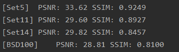

# AM-CSNet
This project is the source code of the thesis AM-CSNet. 
title：Image Compressed Sensing Reconstruction Algorithm Based on Attention Mechanism
## results show：
**MR=0.01**

**MR=0.1**

You can download the train and test dataset from [baidu disk passward：2uvs](https://pan.baidu.com/s/1ooh9He3cZX2xHwTjr6-1Vg)  
Then put data into dataset.

The version of the python package we use is：  
- python 3.6  
- torch1.7.1+cuda11.0  
- torchvision0.8.2  
- swear 0.4.4  
- scipy1.5.4  
- glob、pandas and so on  

you can use the model we provide for testing. 
